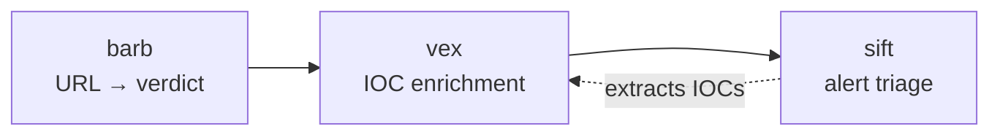

# barb — User Manual

**Version 1.4.0** · Heuristic phishing URL analyzer for SOC/DFIR workflows.

---

## What it is

barb analyzes URLs for phishing indicators using 12 offline heuristic analyzers. It produces a scored verdict — SAFE through PHISHING — and optionally enriches with DNS, RDAP, certificate-transparency, and ASN data. The offline core makes no network calls. Nothing is ever sent to the analyzed host.

**Who it's for:** SOC analysts triaging suspicious URLs, DFIR investigators processing bulk IOC lists, and CI pipelines gating on phishing verdicts.

---

## Quickstart

```bash
pip install barb-phish
barb analyze "http://paypal.com@evil-login.tk/verify"
```

Expected output:

```
╭──────────────────────────────────── barb ────────────────────────────────────╮
│ URL         hxxp[://]paypal[.]com@evil-login[.]tk/verify                     │
│ Verdict     ⚠ HIGH RISK                                                      │
│ Risk Score  7.6                                                              │
╰──────────────────────────────────────────────────────────────────────────────╯
Severity     Analyzer       Finding
────────────────────────────────────────────────────────────────────────────────
CRITICAL     ip_url         URL contains userinfo 'paypal.com' before '@'; the
                            real host is 'evil-login.tk'
MEDIUM       tld            TLD '.tk' is commonly associated with phishing
LOW          keyword        Matched keywords: verify
```

Exit code: `1` (SUSPICIOUS or HIGH_RISK). See [Exit codes](#exit-codes).

---

## Concepts

### Verdict scale

Each URL receives one of five verdicts. The **severity floor** rule escalates the overall verdict if any single signal's severity exceeds what the cumulative score alone would produce.

| Swatch | Verdict | Risk score range | Exit code |
|--------|---------|-----------------|-----------|
| 🟢 | `SAFE` | 0 | `0` |
| 🔵 | `LOW_RISK` | 1–3 | `0` |
| 🟡 | `SUSPICIOUS` | 4–7 | `1` |
| 🟠 | `HIGH_RISK` | 8–12 | `1` |
| 🔴 | `PHISHING` | ≥ 13 | `2` |

Each analyzer emits signals with a severity (INFO / LOW / MEDIUM / HIGH / CRITICAL) and a weight. The raw score is the sum of `severity_points × analyzer_weight` across all signals. The final verdict is whichever is higher: the score-based threshold tier or the maximum individual signal's severity floor.

### Pipeline position

barb is stage 1 in the SOC portfolio. Feed its JSON output into **vex** for VirusTotal/AbuseIPDB enrichment, then into **sift** for alert triage.



---

## Commands

### `analyze`

Analyze one or more URLs for phishing indicators.

**Syntax:**

```
barb analyze [OPTIONS] [URLS]...
```

URLs can be passed as arguments, read from a file (`--file`), or piped from stdin. All three sources can be combined in one invocation.

**Flags:**

| Flag | Short | Default | Description |
|------|-------|---------|-------------|
| `--file PATH` | `-f` | — | File of URLs, one per line |
| `--output TEXT` | `-o` | `rich` | Output format: `rich`, `console`, `json`, `ndjson`, `csv`, `stix` |
| `--quiet` | `-q` | off | Suppress the banner |
| `--explain` | `-e` | off | Append an explanation to output |
| `--threshold INT` | `-t` | `0` | Minimum risk score to report (URLs below the threshold are silently dropped) |
| `--no-defang` | — | off | Print URLs unmodified (default: defanged in terminal output) |
| `--osint` | — | off | Enable opt-in OSINT enrichment (DNS, RDAP, crt.sh, ASN) |
| `--no-cache` | — | off | Bypass the OSINT SQLite cache and force fresh lookups |

**Example — single URL, rich output:**

```bash
barb analyze "http://paypal.com@evil-login.tk/verify" -q
```

```
╭──────────────────────────────────── barb ────────────────────────────────────╮
│ URL         hxxp[://]paypal[.]com@evil-login[.]tk/verify                     │
│ Verdict     ⚠ HIGH RISK                                                      │
│ Risk Score  7.6                                                              │
╰──────────────────────────────────────────────────────────────────────────────╯
Severity     Analyzer       Finding
────────────────────────────────────────────────────────────────────────────────
CRITICAL     ip_url         URL contains userinfo 'paypal.com' before '@'; the
                            real host is 'evil-login.tk'
MEDIUM       tld            TLD '.tk' is commonly associated with phishing
LOW          keyword        Matched keywords: verify
```

**Example — with explanation:**

```bash
barb analyze "http://paypal.com@evil-login.tk/verify" -q --explain
```

```
╭──────────────────────────────────── barb ────────────────────────────────────╮
│ URL         hxxp[://]paypal[.]com@evil-login[.]tk/verify                     │
│ Verdict     ⚠ HIGH RISK                                                      │
│ Risk Score  7.6                                                              │
╰──────────────────────────────────────────────────────────────────────────────╯
Severity     Analyzer       Finding
────────────────────────────────────────────────────────────────────────────────
CRITICAL     ip_url         URL contains userinfo 'paypal.com' before '@'; the
                            real host is 'evil-login.tk'
MEDIUM       tld            TLD '.tk' is commonly associated with phishing
LOW          keyword        Matched keywords: verify

╭──────────────────────────────── Explanation ─────────────────────────────────╮
│ This URL shows strong phishing indicators. Exercise extreme caution.         │
│                                                                              │
│ Detected indicators:                                                         │
│   [CRITICAL] Userinfo in URL: URL contains userinfo 'paypal.com' before '@'; │
│ the real host is 'evil-login.tk'                                             │
│   [MEDIUM] Suspicious TLD: TLD '.tk' is commonly associated with phishing    │
│   [LOW] Phishing keywords in URL path: Matched keywords: verify              │
│                                                                              │
│ Recommendation: Block this URL and investigate the source.                   │
╰──────────────────────────────────────────────────────────────────────────────╯
```

**Example — batch file, JSON output, threshold filter:**

```bash
barb analyze -f urls.txt -o json --threshold 4 -q
```

Only URLs with `risk_score >= 4` appear in output. Exit code reflects the worst verdict across all URLs that were reported.

---

### `update-data`

Refresh the Tranco-based domain allowlist (opt-in, HTTPS only).

Downloads the [Tranco top-1M list](https://tranco-list.eu/) and writes the top `--top-n` domains to `~/.barb/data/allowlist.json`. The bundled curated list is **never overwritten** — it is always merged in. Users who never run this command continue to use the bundled list unchanged.

> [!CAUTION]
> Running `update-data` **expands** false-positive suppression. More domains are treated as known-good after the update, which can reduce phishing signals for obscure or recently added legitimate domains. Run only when you understand this tradeoff.

**Syntax:**

```
barb update-data [OPTIONS]
```

**Flags:**

| Flag | Default | Description |
|------|---------|-------------|
| `--top-n INT` | `5000` | Number of Tranco domains to include |
| `--source TEXT` | `https://tranco-list.eu/top-1m.csv.zip` | Source URL (must start with `https://`) |
| `--quiet` / `-q` | off | Suppress progress messages |

**Example:**

```bash
barb update-data --top-n 10000
```

**Key guarantees:**

- Opt-in only — `barb analyze` never triggers a download.
- Never automatic — no background refresh, no scheduled task.
- HTTPS only — a `--source` that does not start with `https://` is rejected before any network call.
- Atomic write — temp file + `os.replace`; no partial writes visible.
- Write location: `~/.barb/data/allowlist.json` (`0o600`, directory `0o700`).
- No new dependencies — stdlib `urllib` only.

---

### `config`

View the active configuration.

**Syntax:**

```
barb config [OPTIONS]
```

**Flags:**

| Flag | Description |
|------|-------------|
| `--show` | Print the current merged configuration (file + defaults) |

**Example:**

```bash
barb config --show
```

```yaml
scoring:
  weights:
    entropy: 1.0
    homoglyph: 1.5
    tld: 1.0
    subdomain: 1.0
    brand: 1.2
    shortener: 0.8
    encoding: 1.0
    ip_url: 1.0
    typosquat: 1.3
    keyword: 0.6
    lexical: 0.5
    file_ext: 1.0
  thresholds:
    low_risk: 1
    suspicious: 4
    high_risk: 8
    phishing: 13
explain:
  provider: template
  model: null
  api_key: null
  send_url: true
  ollama_host: http://localhost:11434
output:
  default_format: rich
  quiet: false
  defang: true
update_check:
  enabled: true
  check_interval_hours: 24
osint:
  dns_timeout: 2.0
  rdap_timeout: 5.0
  crtsh_timeout: 8.0
  asn_timeout: 3.0
  cache_ttl_hours: 6
```

---

### `version`

Print the installed version and exit.

**Syntax:**

```
barb version
```

```
barb 1.4.0
```

`barb --version` at the top level produces the same output.

---

## Output modes

| Mode | Flag | Best for |
|------|------|----------|
| `rich` | `-o rich` | Interactive terminal — color, tables, defanging |
| `console` | `-o console` | Plain-text terminal — no Rich markup, still defanged |
| `json` | `-o json` | Structured output, one JSON array per run; pipe into jq / vex |
| `ndjson` | `-o ndjson` | Streaming pipelines, log aggregators — one JSON object per line |
| `csv` | `-o csv` | Spreadsheet import, grep workflows |
| `stix` | `-o stix` | SIEM / TIP ingest — STIX 2.1 bundle with `indicator` objects |

**Notes:**

- Defanging (`hxxps[://]evil[.]com`) applies to `rich` and `console` only. JSON/NDJSON/CSV/STIX carry both `url` (original) and `defanged_url` fields.
- The `stix` format emits `indicator` objects for SUSPICIOUS, HIGH_RISK, and PHISHING verdicts. SAFE/LOW_RISK URLs produce no STIX objects (the bundle is still valid). Exit code for STIX output is always `0` because the bundle is emitted successfully — check `verdict`/`confidence` fields for the actual risk.
- `ndjson` is `json` with one object per line and no outer array — better for `tail -f` and streaming ingest.

**JSON output example (two URLs):**

```bash
barb analyze "http://paypal.com@evil-login.tk/verify" "https://bit.ly/3abc123" -o json -q
```

```json
[
  {
    "url": "http://paypal.com@evil-login.tk/verify",
    "defanged_url": "hxxp[://]paypal[.]com@evil-login[.]tk/verify",
    "verdict": "HIGH_RISK",
    "risk_score": 7.6,
    "signals": [
      {"analyzer": "tld", "severity": "MEDIUM", "label": "Suspicious TLD",
       "detail": "TLD '.tk' is commonly associated with phishing", "weight": 1.0},
      {"analyzer": "ip_url", "severity": "CRITICAL", "label": "Userinfo in URL",
       "detail": "URL contains userinfo 'paypal.com' before '@'; the real host is 'evil-login.tk'", "weight": 1.0},
      {"analyzer": "keyword", "severity": "LOW", "label": "Phishing keywords in URL path",
       "detail": "Matched keywords: verify", "weight": 1.0}
    ],
    "explanation": null,
    "analyzed_at": "2026-06-01T11:38:20.435057Z"
  },
  {
    "url": "https://bit.ly/3abc123",
    "defanged_url": "hxxps[://]bit[.]ly/3abc123",
    "verdict": "LOW_RISK",
    "risk_score": 1.6,
    "signals": [
      {"analyzer": "shortener", "severity": "MEDIUM", "label": "URL shortener detected",
       "detail": "Domain 'bit.ly' is a known URL shortener", "weight": 1.0}
    ],
    "explanation": null,
    "analyzed_at": "2026-06-01T11:38:20.435398Z"
  }
]
```

**STIX 2.1 output example:**

```bash
barb analyze "http://paypal.com@evil-login.tk/verify" -o stix -q
```

```json
{
  "type": "bundle",
  "id": "bundle--234c96b9-ad6b-4d96-97aa-ac77d73440a3",
  "objects": [
    {
      "type": "indicator",
      "spec_version": "2.1",
      "id": "indicator--4284e981-79a9-5f8d-a25f-5348c73b0817",
      "name": "Phishing indicator: HIGH_RISK (http://paypal.com@evil-login.tk/verify)",
      "description": "Verdict: HIGH_RISK, Risk score: 7.6. Signals: MEDIUM:tld:Suspicious TLD; CRITICAL:ip_url:Userinfo in URL; LOW:keyword:Phishing keywords in URL path",
      "pattern": "[url:value = 'http://paypal.com@evil-login.tk/verify']",
      "pattern_type": "stix",
      "pattern_version": "2.1",
      "valid_from": "2026-06-01T11:37:22.907981+00:00",
      "indicator_types": ["malicious-activity"],
      "confidence": 75
    }
  ]
}
```

---

## Analyzers

All 12 analyzers run offline on every `barb analyze` invocation. No network access, no API key.

| Analyzer | What it detects | Example |
|----------|----------------|---------|
| **entropy** | High Shannon entropy in the domain or path — indicates generated/random hostnames | `x7k2m9p.evil.com` |
| **homoglyph** | Unicode confusable characters and mixed-script labels (e.g. Latin + Cyrillic in the same label); pure non-ASCII IDN emits a LOW informational signal | `pаypal.com` (Cyrillic `а`) |
| **tld** | Suspicious top-level domains associated with phishing | `paypal-login.tk` |
| **subdomain** | Excessive subdomain depth or domain-squatting patterns | `secure.paypal.com.evil.com` |
| **brand** | Brand name appears in a domain that is not the brand's own registrar | `paypal-secure.evil.com` |
| **shortener** | Known URL shortener services that obscure the real destination | `bit.ly/abc123` |
| **encoding** | Percent-encoding or punycode abuse to disguise the actual host or path | `%70%61%79pal.com` |
| **ip_url** | Bare IP address used as host; `@`-obfuscation where a domain appears before `@` and the real host follows (CRITICAL) | `http://192.168.1.1/login`, `http://paypal.com@evil.com` |
| **typosquat** | ASCII lookalike brand names via Levenshtein distance 1–2 and digit-for-letter swaps; official brand domains are skipped | `paypa1.com`, `g00gle.com` |
| **keyword** | Phishing-pattern keywords in the URL path or query string (login, verify, secure, webscr, bank, …); aggregated into one LOW signal | `/login/verify-account` |
| **lexical** | URL length, hyphen count, and digit ratio; emits LOW signals for suspicious structural patterns | `my-secure-bank-update-2024.com` |
| **file_ext** | Suspicious file extensions in the URL path: double-extension masquerade → HIGH, single executable or script → LOW, archive → INFO | `invoice.pdf.exe`, `setup.ps1` |

---

## OSINT enrichers

Enable with `--osint`. Off by default. All enrichers are **fail-open**: a timeout or connection error drops that enricher's signals and analysis continues offline. No API key required for any enricher.

> [!NOTE]
> `--osint` queries infrastructure *about* the domain — it never contacts the analyzed URL itself. See [Security](#security) for the full privacy footprint.

| Enricher | Protocol / endpoint | What it checks | Signals |
|----------|--------------------|--------------------|---------|
| **DNS** | `socket.getaddrinfo` via your system resolver (stdlib, timeout 2 s) | Resolves the host to one or more IPs | HIGH on loopback or sinkhole IP; MEDIUM on private IP or NXDOMAIN |
| **RDAP** | IANA RDAP bootstrap → TLD registry RDAP server, `urllib` stdlib (timeout 5 s); no API key | Domain registration age and registrant redaction | HIGH if domain < 30 days old; MEDIUM if < 90 days; LOW if registrant privacy / redacted |
| **crt.sh** | `https://crt.sh/` (Sectigo CT log), `urllib` stdlib (timeout 8 s); sends hostname only | Most recent TLS certificate issuance date in Certificate Transparency logs | MEDIUM if newest cert < 7 days old; LOW if < 30 days; INFO if no CT records found |
| **ASN** | Team Cymru WHOIS (`whois.cymru.com:43`), stdlib socket (timeout 3 s); sends resolved IP only | Hosting ASN number, name, country, and BGP prefix | INFO — analyst context only; **no score impact** |

**Cache:** Results are stored per host in `~/.barb/cache.db` (SQLite, default TTL 6 hours). Use `--no-cache` to force fresh lookups. The cache path and TTL are configurable — see [Configuration](#configuration).

**Example with OSINT:**

```bash
barb analyze "https://suspicious-site.tk/paypal-login" --osint -q
```

---

## Detection quality (measured)

### Methodology

The eval harness in `eval/` scores barb against a labeled URL corpus. The corpus is built from two feeds:

- **Phishing:** 300 URLs from the OpenPhish community feed (`eval/fetch_corpus.py` fetches and labels them).
- **Benign:** 500 URLs from the Tranco top-500 list (most-popular domains, expected clean).

Alert tier: verdict ≥ SUSPICIOUS counts as a positive detection.

### Results — v1.4.1 (offline core, snapshot 2026-06-01)

| Metric | Value | Detail |
|--------|-------|--------|
| Precision | **1.00** | 0 false positives out of 500 benign URLs |
| Recall | **0.07** | 22 of 300 phishing URLs caught |
| False-positive rate | **0.00** | 0 of 500 benign URLs flagged |

### Interpretation

> [!IMPORTANT]
> barb is a **high-precision URL-structure pre-filter**. When it emits SUSPICIOUS or higher, that verdict is reliable (precision 1.00 on this corpus). It is **not a standalone phishing catch-all**.
>
> Low recall is by design. barb inspects URL structure only and never fetches the URL, so phishing campaigns that use clean-looking URLs on abused legitimate hosting (`github.io`, `pages.dev`, plain `.com`, short paths) fall below the detection threshold. That is an inherent limit of URL-only heuristics, not a bug.
>
> Close the recall gap with the downstream pipeline:
> - `--osint` for fresh-domain signals (RDAP registration age, crt.sh certificate recency).
> - **vex** for VirusTotal / AbuseIPDB reputation lookup on barb's flagged URLs.
> - **sift** for alert correlation across the full event stream.

### CI regression gate vs. field measurement

The repo contains a synthetic fixture (`eval/fixtures/`) that drives a pytest-based regression gate. That fixture reports precision 1.00 / recall 0.76 — numbers intentionally higher than the real corpus because the fixture is constructed from known-bad URL patterns that exercise every analyzer. It catches score regressions between releases; it is **not** a field performance claim.

The real corpus uses live feeds, so the numbers above are a reproducible snapshot, not a fixed guarantee. Phishing feed composition changes over time.

### Reproduce the numbers

```bash
# Build the corpus (fetches OpenPhish + Tranco, writes eval/corpus/real.csv)
python -m eval.fetch_corpus

# Score barb against it and print precision/recall/F1
python -m eval.run_eval --corpus eval/corpus/real.csv
```

Both scripts are in the repo root. No extra dependencies beyond `barb-phish[dev]`.

---

## Explanations

Pass `--explain` to append a plain-language explanation of the signals to the output. The explanation provider is set in `~/.barb/config.yaml` under `explain.provider`.

| Provider | Requires | Notes |
|----------|----------|-------|
| `template` | Nothing | Default. Offline, deterministic, no network calls. |
| `anthropic` | `pip install barb-phish[llm]` + `BARB_LLM_KEY` env var | Calls Anthropic Claude API. Sends defanged URL and signals unless `send_url: false`. |
| `openai` | `pip install barb-phish[llm]` + `BARB_LLM_KEY` env var | Calls OpenAI API. Same data-send behavior as anthropic. |
| `ollama` | Local [Ollama](https://ollama.ai) server running | No API key, no data leaves host. Falls back to template if Ollama is unreachable. |

> [!IMPORTANT]
> The `anthropic` and `openai` providers require the `[llm]` extra (`pip install barb-phish[llm]`) and the `BARB_LLM_KEY` environment variable. The `template` provider (default) needs neither.

**Ollama config example:**

```yaml
explain:
  provider: "ollama"
  model: "llama3.1"
  ollama_host: "http://localhost:11434"
  send_url: false    # omit URL from prompt for maximum privacy
```

If Ollama is unreachable when `--explain` is used, barb prints a note to stderr and falls back to the template explainer. The command always completes.

**`send_url`:** when `true` (default), the defanged URL is included in the LLM prompt. Set to `false` to send only the signal labels and severities, without the URL.

---

## Configuration

barb reads `~/.barb/config.yaml` at startup. CLI flags override config values, which override compiled-in defaults. Create the file to persist any setting.

**Full config example with all fields:**

```yaml
scoring:
  weights:
    entropy: 1.0
    homoglyph: 1.5
    tld: 1.0
    subdomain: 1.0
    brand: 1.2
    shortener: 0.8
    encoding: 1.0
    ip_url: 1.0
    typosquat: 1.3
    keyword: 0.6
    lexical: 0.5
    file_ext: 1.0
  thresholds:
    low_risk: 1
    suspicious: 4
    high_risk: 8
    phishing: 13

explain:
  provider: "template"       # template | anthropic | openai | ollama
  model: null                # e.g. "gpt-4o" for openai, "llama3.1" for ollama
  api_key: null              # or set BARB_LLM_KEY env var
  send_url: true             # include defanged URL in LLM prompt
  ollama_host: "http://localhost:11434"

output:
  default_format: "rich"     # rich | console | json | ndjson | csv | stix
  quiet: false
  defang: true               # defang URLs in terminal output

update_check:
  enabled: true
  check_interval_hours: 24

osint:
  dns_timeout: 2.0           # seconds
  rdap_timeout: 5.0          # seconds
  crtsh_timeout: 8.0         # seconds
  asn_timeout: 3.0           # seconds
  cache_ttl_hours: 6         # SQLite cache TTL (~/.barb/cache.db)
```

**Priority hierarchy:** CLI flags → environment variables → `~/.barb/config.yaml` → compiled-in defaults.

**Environment variable:** `BARB_LLM_KEY` sets the API key for `anthropic` and `openai` providers. It overrides `explain.api_key` in the config file.

**Config directory:** `~/.barb/` is created with `0o700` permissions; `config.yaml` and `cache.db` are created with `0o600`.

---

## Exit codes

| Code | Condition |
|------|-----------|
| `0` | All reported URLs are SAFE or LOW_RISK |
| `1` | At least one URL is SUSPICIOUS or HIGH_RISK (and none is PHISHING) |
| `2` | At least one URL is PHISHING |
| `3` | Error — invalid input, missing file, non-HTTPS `--source`, or no URLs provided |

The exit code reflects the **worst verdict** across all URLs analyzed in a single invocation.

> [!NOTE]
> `--threshold` filters which URLs appear in output, but the exit code is still based on the worst verdict among the URLs that *were* reported (i.e. those at or above the threshold).

---

## Integration

### Stdin / pipe

barb reads from stdin when no `[URLS]` arguments and no `--file` are provided:

```bash
cat urls.txt | barb analyze -o csv -q
```

### Batch file

```bash
barb analyze -f ioc_list.txt -o json -q > results.json
```

### Filter by score threshold

Only show URLs with risk_score >= 5:

```bash
barb analyze -f ioc_list.txt -o console --threshold 5 -q
```

### Use in shell scripts

```bash
barb analyze "$URL" -q -o json
if [ $? -eq 2 ]; then
    echo "PHISHING — blocking $URL"
fi
```

### Pipe JSON into jq

```bash
barb analyze -f urls.txt -o json -q | jq '.[] | select(.verdict == "HIGH_RISK") | .url'
```

### Pipe into vex for IOC enrichment

```bash
barb analyze -f urls.txt -o json -q \
  | jq -r '.[] | select(.risk_score >= 4) | .url' \
  | vex triage --stdin
```

barb handles the heuristic pre-filter; vex handles VirusTotal enrichment for the surviving candidates.

### NDJSON for streaming pipelines

```bash
tail -f access.log | grep -oP 'https?://\S+' | barb analyze -o ndjson -q
```

### STIX for SIEM ingest

```bash
barb analyze -f iocs.txt -o stix -q > indicators.json
# import indicators.json into your TIP/SIEM
```

---

## Troubleshooting

| Symptom | Cause | Fix |
|---------|-------|-----|
| `--osint` is slow | crt.sh has an 8-second timeout per query; slow registries can push RDAP close to 5 s | This is expected on first lookup. Results are cached for 6 hours. Use `--no-cache` only when fresh data is needed. |
| `--osint` returns no enrichment signals | A timeout or DNS error occurred | barb is fail-open — analysis completes with offline signals only. Check connectivity. |
| `ollama` explanation shows template output | Ollama server was unreachable | barb fell back to template automatically. Check that `ollama serve` is running and `ollama_host` in config matches. |
| `update-data` exits with error about HTTPS | `--source` URL does not start with `https://` | Supply an `https://` URL. Non-HTTPS sources are rejected before any network call. |
| No signals on a known-benign URL | Expected behavior | Benign domains on the allowlist have domain-based signals suppressed. Path/query signals still fire. A score of 0.0 / SAFE is the correct result. |
| `barb: command not found` | barb is not on `$PATH` | Run `pip install barb-phish` or activate the venv that contains barb. |
| JSON output contains `"explanation": null` | `--explain` was not passed | Add `--explain` to the command. |
| Exit code is `3` with "no URLs" message | No URLs were provided via arguments, `--file`, or stdin | Provide at least one URL. |

---

## Security

> [!WARNING]
> **Never makes HTTP requests to the analyzed URL.** Offline core makes no network calls and never fetches the URL.

> [!WARNING]
> **`--osint` is opt-in and fail-open; no API key required.**

> [!WARNING]
> **All detection data is bundled static JSON — no runtime downloads.** The one explicit exception is the opt-in `update-data` command, which downloads the Tranco list over HTTPS only when the user runs it.

### Privacy footprint

The offline core makes **zero** outbound connections.

When you pass `--osint`, barb makes the following requests — **never to the analyzed host itself**:

| Connection | Endpoint | What it reveals | Notes |
|------------|----------|-----------------|-------|
| DNS resolution | Your system resolver (`/etc/resolv.conf`, port 53) | The domain being looked up | Same lookup any browser makes |
| RDAP bootstrap | `https://data.iana.org/rdap/dns.json` | That you use barb/RDAP | Fetched at most once per 7 days, cached at `~/.barb/rdap_bootstrap.json` |
| RDAP query | The TLD registry RDAP server (e.g. `rdap.verisign.com` for `.com`) | The domain being investigated | No API key; stdlib `urllib` only |
| crt.sh CT query | `https://crt.sh/` (Sectigo) | The domain being investigated | Reveals domain-of-interest to Sectigo; no API key; stdlib `urllib` only |
| ASN lookup | `whois.cymru.com` port 43 (Team Cymru) | The **resolved IP** of the domain | Sends only the IP — not the URL or hostname |

- The suspect host is **never contacted** — no HTTP GET/HEAD to the URL, no DNS beacon to attacker-controlled infrastructure beyond normal name resolution.
- No credentials are transmitted.
- All OSINT calls are fail-open: a timeout or error drops that enricher's signals, and analysis continues with the offline results.
- OSINT results are cached per host in `~/.barb/cache.db` (default TTL 6 h). Repeat lookups make no network calls. `--no-cache` forces fresh requests.
- URL length is capped at 2048 characters.
- `~/.barb/` is created with `0o700` permissions; individual files with `0o600`.

---

## See also

- [README](../README.md) — installation, quick start, feature overview
- [vex](https://github.com/duathron/vex) — IOC enrichment hub (VirusTotal + AbuseIPDB/Shodan); feed barb JSON output into vex
- [sift](https://github.com/duathron/sift) — SOC alert triage summarizer; stage 3 in the portfolio pipeline
