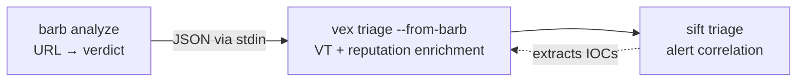

# Pipeline

[← Docs index](README.md)

barb is **stage 1** in a three-tool chain. It pre-screens URL structure
heuristically; **vex** enriches the surviving IOCs against VirusTotal and other
threat-intel sources; **sift** correlates and triages the alert stream.



barb sits upstream of vex. It performs no VirusTotal or AbuseIPDB calls itself
and has no code dependency on vex or sift — the integration is a pipe contract
only (JSON on stdout, read on stdin).

---

## barb → vex

Pre-scan URLs with barb, then enrich the survivors with VirusTotal.

```bash
barb analyze -f urls.txt -o json -q | vex triage --from-barb
```

### What barb outputs (`-o json`)

A JSON array of `AnalysisResult` objects. The fields vex reads:

```json
[
  {
    "url": "https://evil-login.tk/verify",
    "verdict": "HIGH_RISK",
    "risk_score": 7.6,
    "defanged_url": "hxxps[://]evil-login[.]tk/verify",
    "signals": [
      { "analyzer": "ip_url", "severity": "CRITICAL", "label": "Userinfo in URL",
        "detail": "...", "weight": 1.0 }
    ],
    "explanation": null,
    "analyzed_at": "2026-06-01T16:24:24Z"
  }
]
```

Required by vex: `url`. Everything else (`verdict`, `risk_score`, `signals`)
populates the barb pre-scan context shown alongside the VirusTotal result.

### What vex does (`--from-barb`)

1. Reads the barb JSON array from stdin.
2. Extracts each `url` and submits it to VirusTotal as an IOC.
3. Displays barb's pre-scan verdict and top signals **alongside** the VT result,
   so you see both the heuristic call and the reputation call together.
4. Emits results in whatever `--output` format you chose.

Source of truth: `vex/pipeline/barb_bridge.py::parse_barb_json` (in the vex
repo).

### Filtering before handoff

Use `--threshold` and `jq` to limit the vex query to URLs barb already flagged:

```bash
# Only pass SUSPICIOUS or worse (score >= 4) to vex
barb analyze -f urls.txt -o json -q \
  | jq -c '.[] | select(.risk_score >= 4)' \
  | vex triage --from-barb
```

Or let vex read the full barb output and filter on its side with `--alert`:

```bash
barb analyze -f urls.txt -o json -q | vex triage --from-barb --alert SUSPICIOUS
```

---

## vex → sift

After vex enriches the IOCs, feed the results into sift for alert correlation and
triage:

```bash
sift triage alerts.json -o json | vex triage --from-sift
```

See vex's [Pipeline](https://github.com/duathron/vex/blob/main/docs/pipeline.md)
and sift's documentation for the full sift ↔ vex contract. barb's role ends at
the vex handoff.

---

## Why barb stays pipe-only

barb does **not** import or call vex/sift code directly. The integration is a
plain UNIX pipe:

- barb writes a JSON array to stdout.
- vex reads it from stdin via `--from-barb`.
- The two tools can be deployed, versioned, and updated independently.
- A user who does not have vex installed loses nothing from barb's core
  functionality.
- The contract is stable: as long as barb's JSON output carries `url`, `verdict`,
  `risk_score`, and `signals`, the handoff works regardless of internal changes in
  either tool.

---

## End-to-end worked example

```bash
# 1. barb pre-screens a URL list and saves JSON
barb analyze -f urls.txt -o json -q > barb_results.json

# 2. Inspect high-risk URLs with jq
cat barb_results.json | jq '.[] | select(.verdict == "HIGH_RISK" or .verdict == "PHISHING") | .url'

# 3. Pipe barb JSON into vex for VirusTotal enrichment (requires vex + VT key)
cat barb_results.json | vex triage --from-barb -o json > vex_enriched.json

# 4. Export STIX for SIEM ingest
barb analyze -f urls.txt -o stix -q > indicators.json
```

> [!WARNING]
> **Never makes HTTP requests to the analyzed URL. Offline core makes no network
> calls and never fetches the URL.** vex handles reputation lookups; barb handles
> structural heuristics. The split is intentional.
